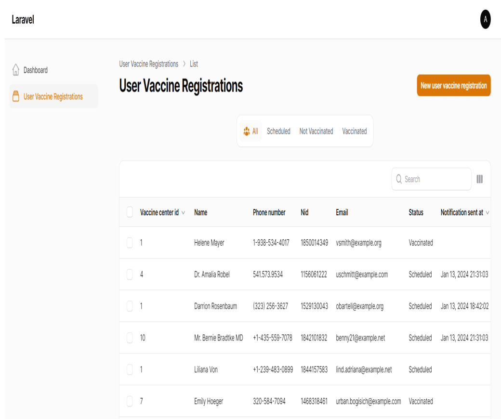

## Laravel: Vaccine Registration System

-----

### How to use

- Clone the project with `git clone`
  [https://github.com/sahinuddinrony/Laravel-Vaccine-registration-system.git]
- Copy `.env.example` file to `.env` and edit database credentials there
- Run `composer install`
- Run `php artisan key:generate`
- Run `php artisan migrate --seed` (it has some seeded data for your testing)
- Run `php artisan serve`
- That's it: launch the main URL

### Run queue and task scheduling
 - Run `php artisan queue:work`
 - Run `php artisan  schedule:work`

---

**I also use filament php to see user list in dashboard**
### Login Info

> http://127.0.0.1:8000/admin

> email address:  ***admin@test.com***

> password:  ***password***
---

## More

- Linkedin [https://www.linkedin.com/in/sahinuddinrony/)

