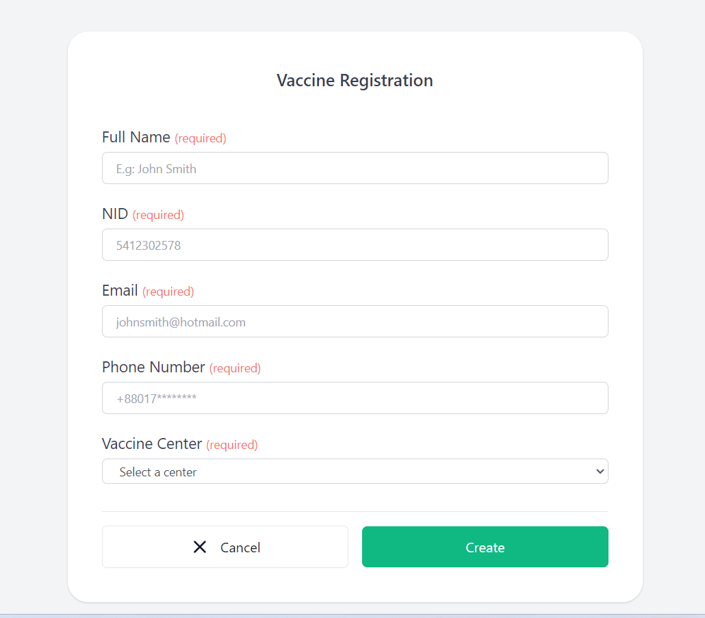

## Laravel Breeze: Tailwind Pages Skeleton

-----

### How to use

- Clone the project with `git clone`
- Copy `.env.example` file to `.env` and edit database credentials there
- Run `composer install`
- Run `php artisan key:generate`
- Run `php artisan migrate --seed` (it has some seeded data for your testing)
- That's it: launch the main URL

---

## More from our LaravelDaily Team

- Enroll in our [Laravel Daily Courses](https://laraveldaily.com/)
- Check out our adminpanel generator [QuickAdminPanel](https://quickadminpanel.com)
- Purchase our [Livewire Kit](https://livewirekit.com)
- Subscribe to our [YouTube channel Laravel Daily](https://www.youtube.com/channel/UCTuplgOBi6tJIlesIboymGA)
